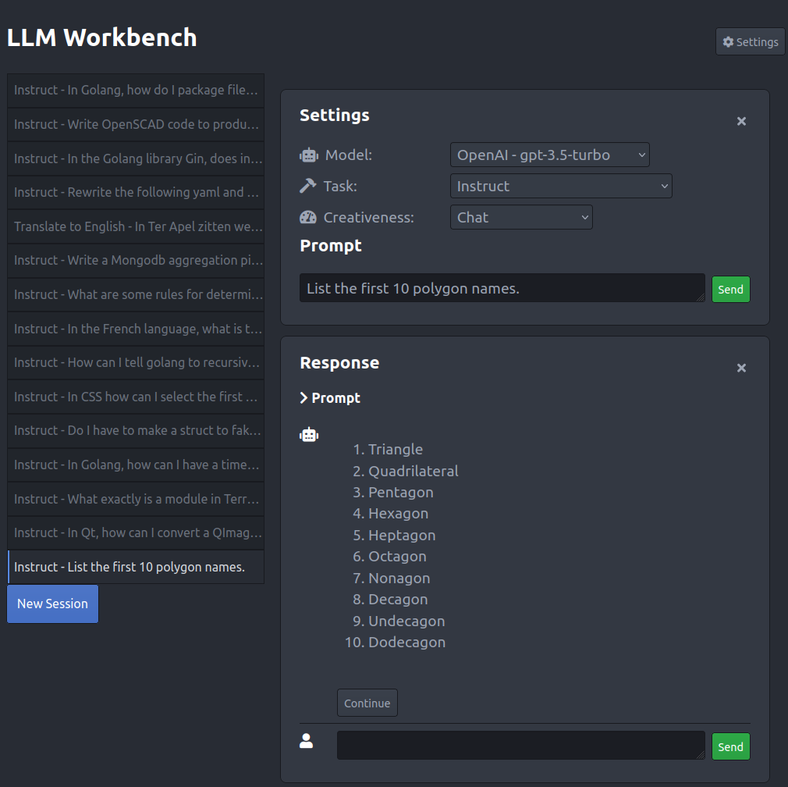

# llm-multitool

**llm-multitool** is a local web UI for working with large language models (LLM). It oriented towards *instruction tasks* and can connect to and use different servers running LLMs.




## Features

* Aims to be easy to use
* Supports different LLM backends/servers including locally run ones:
  * [OpenAI's ChatGPT](https://openai.com/chatgpt)
  * [Ollama](https://github.com/jmorganca/ollama)
  * and most backends which support the OpenAI API such as [LocalAI](https://localai.io/) and [Oobabooga](https://github.com/oobabooga/).
* "Instruction" templates to simplify certain tasks.
* Chat support for backends which support it.
* Multiple persistent sessions and history


## Downloading

Executables for Windows, macOS, and Linux can be downloaded from the [Releases page](https://github.com/sedwards2009/llm-multitool/releases).

## Building from source

Instead of downloading a precompiled executable you can also build it from source.

### Build Dependencies

* This project uses [Taskfile](https://taskfile.dev/) for building. The `task` executable must be available in your path. You can install the `task` binary from https://taskfile.dev/ .
* [Go](https://go.dev/) compiler
* Recent [Node JS](https://nodejs.org/) version.

### Building

Run `task prepare` and `task build` to prepare and build llm-multitool. It will first build the web frontend and then the Go based backend. The output executable will be in the `backend/` folder and named `llm-multitool`.

## Backends

llm-multitool is just a UI for LLMs. It needs a LLM backend to connect to which actually runs the model. But which one should you use?

Short answer:

* If you don't want to run a LLM locally then you should set up OpenAI's ChatGPT.
* If you do want to run a LLM locally then try Ollama.

The backends in more detail:

* **[OpenAI's ChatGPT](https://openai.com/chatgpt)** - Support for this backend is the most complete and stable. It does require setting up billing and an API token at OpenAI to use.
* **[Ollama](https://ollama.ai/)** - This can run LLMs locally, is easy to set up, and supports Linux, Windows, and macOS. Version v0.1.14 or later is required.
* **[LocalAI](https://localai.io/)** - This will also let you run LLMs locally, is easy to set up and supports many different LLMs, but only runs Linux and macOS. llm-multitool supports this quite well via it's OpenAI API.
* **[Oobabooga text-generation-ui](https://github.com/oobabooga/)** - This backend can be a challenge to install and isn't really meant for end users. It does support have many LLM types. llm-multitool support for this mostly works but is buggy.

Note: It should be possible to connect llm-multitool to most things which support the OpenAI API.


## Configuring a backend

Before running llm-multitool you first need to write a small configuration file in yaml to set up which backend(s) it should connect to and how. By default you can name this file `backend.yaml`. Its name can be specified when starting llm-multitool.

This configuration file consists of 1 or more backend configurations in a YAML list. You may have as many backends configured as you want. At start up llm-multitool will query each backend for its list of models. If a backend is not available, then it is jus skipped.

Below are sections on how to configure the different backends.

### OpenAI Configuration

The following example `backend.yaml` file shows how to connect to OpenAI's ChatGPT model. You need to generate your own API token on OpenAI's website to use in the file.

```yaml
- name: OpenAI
  api_token: "sk-FaKeOpEnAiToKeN7Nll3FAKzZET3BlbkFJLz8Oume19ZeAjGh3rabc"
  models:
  - gpt-3.5-turbo
  - gpt-4
```
The `name` field can be any name you like, but it is best to keep it short.

`api_token` holds the value of the token you generated at OpenAI.

If you don't want to copy your token directly into your configuration file, you can omit the `api_token` file and replace it with `api_token_from` with a value naming a text file from which to read the read token from. The file path is relative to the `backend.yaml` file.

`models` is a list of model to permit. OpenAI have many different models and varieties, but only a handful of the the LLMs are useful for use with llm-multitool.

### Ollama

llm-multitool can connect to a Ollama server via its own API. The configuration block is as follows:

```yaml
- name: Ollama
  address: "http://localhost:11434"
  variant: ollama
```

The `name` field can be any name you like, but it is best to keep it short.

The `address` field is the URL of the Ollama server.

The `variant` field must have the value "ollama".


### LocalAI

LocalAI and OpenAI configuration is the same thing except that LocalAI needs an `address` value to be specified and it doesn't require the `token` or `model` values.

```yaml
- name: LocalAI
  address: "http://127.0.0.1:5001/v1"
```

The `address` field is the URL of the LocalAI server.

### Oobabooga text-generation-ui

llm-multitool can connect to a running Oobabooga text-generation-ui server via its OpenAI extension.

⚠️ You need to set up and activate the `openai` extension in your Oobabooga installation. The `README.md` file under Oobabooga's `extensions/openai/` folder gives more details. Also, when starting Oobabooga you need to turn the extension on.

The configuration needed in `backend.yaml` is typically:

```yaml
- name: Ooba
  address: "http://127.0.0.1:5001/v1"
  variant: oobabooga
```

The `name` field can be any name you like, but it is best to keep it short.

The `address` field is the URL of the OpenAI end-point running on Oobabooga.

The `variant` field must have the value "oobabooga".

## Running

If you have built llm-multitool from source then the executable will be in `backend/llm-multitool` and you should have written a minial `backend.yaml` file. Start up `llm-multitool` with:

    backend/llm-multitool -c backend.yaml

This will start the server and it will listen on address `127.0.0.1` port `5050` by default.

Open your browser on http://127.0.0.1:5050 to use the llm-multitool UI.

## Command line reference

    usage: llm-multitool [-h|--help] [-c|--config "<value>"] [-s|--storage
    "<value>"] [-p|--presets "<value>"] [-t|--templates
    "<value>"] [-a|--address "<value>"]

    Web UI for instructing Large Language Models

    Arguments:

    -h  --help       Print help information
    -c  --config     Path to the configuration file. Default: backend.yaml
    -s  --storage    Path to the session data storage directory. Default: data
    -p  --presets    Path to the file containing generation parameter presets.
    Default:
    -t  --templates  Path to the file containing templates. Default:
    -a  --address    Address and port to server from. Default: 127.0.0.1:5050


## Custom instruction templates

llm-multitool has a small set of built in templates for instruct type tasks. You can read this yaml file up on GitHub [here](https://github.com/sedwards2009/llm-multitool/blob/main/backend/config/templates.yaml). It is possible to create your own templates file and tell llm-multitool to use it with the `-t` command line option.

The format of the templates yaml file is an array of template objects. Each template object has the following fields:

* `id` - A unique string to identify the template. UUIDs work well here, but any string is accepted
* `name` - The name of the template. This will be shown in the web UI. For example, "Translate to French"
* `template_string` - The template for the prompt itself. The string `{{prompt}}` will be replaced with what ever the user enters as the prompt in the web UI.

If you write an interesting template, consider submitting it to this project for inclusion.

## Custom parameter presets

llm-multitool has a small set of built in parameter presets. These control the generation of responses. You can read this yaml file up on GitHub [here](https://github.com/sedwards2009/llm-multitool/blob/main/backend/config/presets.yaml). It is possible to create your own presets file and tell llm-multitool to use it with the `-p` command line option.

* `id` - A unique string to identify the preset.
* `name` - The name of the preset. This will be shown in the web UI.
* `temperature` - a numeric value specifying the temperature value to use during generation. For example, 0.8
* `top_p` - a numeric value specifying the Top P setting to use during generation. For example, 0.1


## License

MIT

## Author

Simon Edwards <simon@simonzone.com>
